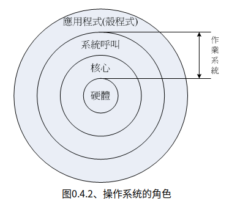
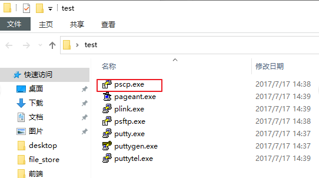
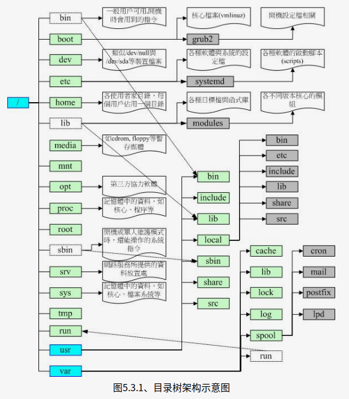
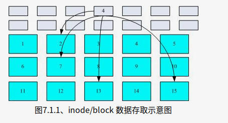
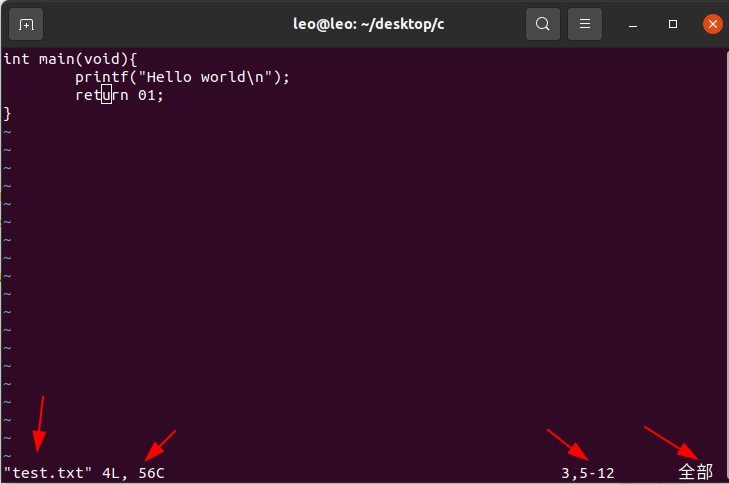
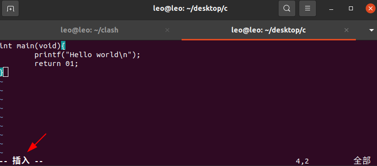
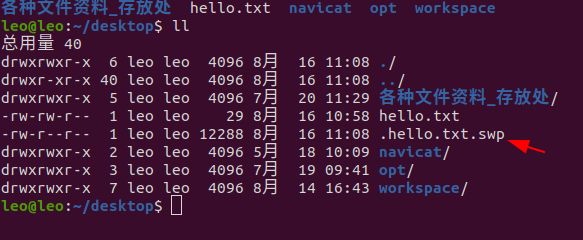
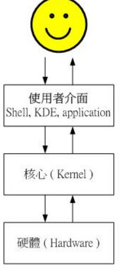

## 博主前言

以下内容是主要由<鸟哥的Linux私房菜 基础学习篇(第四版)>和<完美应用Ubuntu(第四版)>两本书整理而成
再加上一些我在学习过程中看的一些文章和个人实践.

**为什么是上面这个组合**

因为我司的服务器版本全都是Ubuntu, 为了能装Docker, 装JDK, 装ES, 发项目这些工作才开始学正儿八经学习Linux.
期间买个云服务器, 把工作时用的电脑也换成了Ubuntu, 公司服务器操作前先在自己本地演练一遍.
踩了不少坑, 也学到了不少东西, 所以本书内容也会比较全面(杂)

**适合那些读者**

- 想学习Linux的
- 会RedHat/centOS, 想了解下Debian/Ubuntu的
- 在用Ubuntu了, 想再深入学习一下
- 嫌<私房菜>太啰嗦的, 想看精简版的
- 嫌鸟哥的用语都是台湾叫法, 看着很别扭的
- 看完书了, 想找份写好的笔记


## 第零章 计算机概论

### 什么是计算机

图灵说: 只要有输入设备、输出设备，可以输入数据并且该机器可以产生信息并输出的
冯诺伊曼说: 我定义出来一个计算机模型, 把计算机分为4个子系统：存储器，运算器，控制器，输入/输出设备
输入设备：键盘、鼠标、扫描仪、手写板、触摸屏
输出设备：屏幕、打印机

**举例**：计算器、手机、ATM取款机


### 计算机分类

- 超级计算机（Supercomputer）：运行速度最快的电脑，费用也最高/最贵。常用于国防军事、气象预测、太空科技
- 大型计算机（Mainframe Computer）：有多个高速的CPU，比超算差点。用于证券交易所这种每天需要处理数百万笔数据的情况
- 工作站（Workstation）:针对特殊用途而设计的电脑，强调稳定不死机，并且运算过程完全正确。
- 微电脑（Microcomputer）:麻雀虽小，五脏俱全。现在的个人电脑、智能手机

**BAT为什么不用超算？**
互联网企业要处理的是高并发/高吞吐的任务，满足百万日活，满足千万人同时在线，满足几百亿的交易等。这种任务要用专门为了吞吐和IO的数据中心，而不是用超算。超算的优点是算的特别快，不是IO特别强。

**电脑和手机区别？**
电脑是主板上可以物理拔/插CPU、内存、硬盘，手机是直接将这些元件焊死到主板上

**CPU架构**

- 精简指令集 （Reduced Instruction Set Computer, RISC）：每个指令完成的动作很单纯/时间短/耗能低，若要做复杂的事情就要写多个指令。设计最好的就是英国ARM公司的ARM指令集(ARM架构)，广泛应用在智能手机、平板电脑、交换机、路由器上
- 复杂指令集（Complex Instruction Set Computer, CISC）:  设计最好的是AMD、Intel两家公司的x86架构，常用到个人电脑上

**为什么有种叫x86架构？**
因为最早欢迎的CPU架构是Intel公司型号为8086的，后来又依此架构开发出80286、80386，都是以86结尾

Intel将x86架构由8位升级到16、32位
AMD将x86升级为64位，这种架构称为x86_64、amd64
64位代表CPU一次可以读写64bit数据

**不同x86架构有什么差异呢?**
新x86架构含有更先进的微指令集，可以加速多媒体程序的运行，也能加强虚拟化的性能，更省电等

CPU衡量单位：3.6GHz = 3.6 * 1000 * 1000 * 1000 = 3.6 * 10<sup>9</sup>，即每秒可以执行3.6  * 10<sup>9</sup>次计算
CPU架构不同：有不同型号：i386、i586、i686。程序需要对CPU做适配才能运行，所以不同平台的安装包是不能随便装到其他不同CPU电脑上的

```bash
这是一个开源软件打的分发包
clash-windows-386-v1.11.8.zip
clash-windows-amd64-v1.11.8.zip          # win平台的x86架构下的64位包
clash-windows-amd64-v3-v1.11.8.zip
clash-windows-arm32v7-v1.11.8.zip
clash-windows-arm64-v1.11.8.zip          # win平台的arm架构下的64位包

clash-linux-386-v1.11.8.gz               # linux系统386cpu的包
clash-linux-amd64-v1.11.8.gz             # linux系统x86架构64位包
clash-linux-amd64-v3-v1.11.8.gz
clash-linux-armv5-v1.11.8.gz
clash-linux-armv6-v1.11.8.gz
clash-linux-armv7-v1.11.8.gz
clash-linux-armv8-v1.11.8.gz              # linux系统arm架构不同版本的包
clash-linux-mips-hardfloat-v1.11.8.gz
clash-linux-mips-softfloat-v1.11.8.gz
clash-linux-mips64-v1.11.8.gz
clash-linux-mips64le-v1.11.8.gz
clash-linux-mipsle-hardfloat-v1.11.8.gz
clash-linux-mipsle-softfloat-v1.11.8.gz

clash-freebsd-386-v1.11.8.gz              # unix的重要分支freeBSD分支
clash-freebsd-amd64-v1.11.8.gz
clash-freebsd-amd64-v3-v1.11.8.gz
clash-freebsd-arm64-v1.11.8.gz

clash-darwin-amd64-v1.11.8.gz               # 苹果系统的开源内核名称
clash-darwin-amd64-v3-v1.11.8.gz
clash-darwin-arm64-v1.11.8.gz
```


**动态随机存取内存（Dynamic Random Access Memory, DRAM）**
买内存时经常会看到型号DDR（双倍数据传送速度 Double Data Rate），DDR1、DDR2、DDR3、DDR4、DDR5依次更快，现在最新的是DDR5
DDR3L (low)用的电压更低，笔记本用，相应速度会慢一点
多通道：cpu和内存一般是一个通道，想更快就可以再加一个通道。两个通道（卡槽）插的内存条型号得一样，因为两个通道传输的数据会是一样的


**只读存储器（ROM）**
主板的网卡、显卡等硬件启动参数被记录到CMOS芯片，这个芯片需要额外的电源来发挥记录功能，这也就是为什么主板上面会有一颗电池

谁写入CMOS？
答: BIOS

固件（firmware）：硬件的控制软件；硬盘、的网卡、交换机都有，BIOS也是一个固件
BIOS（Basic Input Output System）：是一套程序，开机时载入CMOS的参数用来开机，BIOS记录的位置就是ROM。现在BOIS已经被改进成记录到闪存(一种可读写的存储介质)


**显卡VGA（Video Graphics Array）**
用来控制幕像素点的，想显示的细腻就得用显卡，之前是CPU来控制，但cpu很忙的，so用显卡专事专办效率更高。玩3D游戏、看3D电影都要好的显卡。
在显卡中加入3D加速芯片，就称为GPU
显卡与屏幕的接口：VGA、HDMI等常见的显示器连接线接口

**硬盘**

- 为了有规则读写，就把转盘划了一个个小块(512Byte)
- MBR（每块512Byte）格式和 GPT(每块4K)是两种不同的硬盘分区方式
- 马达要去转到相应位置才能读写，所以读写文件很慢
- 磁头与盘的接触的空间很小，如果抖动或有灰尘那硬盘就坏了
- 机械手臂必须归位才能下一次操作，所以不能直接拔掉电源的方式关机


**操作系统**
什么是程序？ 硬件只认0/1组成的机器语言，0/1不好写
高级语言？ c、c++、java高级语言,虽然还是不好懂，但至少是人类可阅读、可理解的英文啦。
核心（Kernel，操作系统核心）：每个硬件里面的机器码接口都不一样，这么多接口不好对接、不好移植。所以出现了核心，有Kernel与硬件沟通，管理电脑的所有活动以及驱动所有硬件。只要硬件不同（x86架构与ARM架构）Kernel就得根据CPU重写，所以Kernel也要用可移植的高级语言写。
系统调用（System Call）：核心提供的一套开发接口，让上层应用程序调用
操作系统（Operating System, OS）：核心和系统调用加起来成为OS；由OS和硬件打交道，这样工程师只开发功能逻辑
驱动程序：操作系统会提供接口，让硬件商制作他们的驱动程序。也就是对接硬件接口的工作分配给了厂商。




bit 比特：0/1 二进制单位
Byte字节：0/1没法表达复杂数据，所以最简单的数据也需要用8个bit来记录；1Byte = 8bit 
K:  Byte也太小了，人类根本无法感知，所以平时见到的单位是K；1k = 1024Byte

**500G硬盘为什么实际存储只有466G？**
CPU运算速度GHz、网速MHz、硬盘常用GB来表述，是千进制。
500G硬盘是：500G * 1000M * 1000k * 1000Byte = X
转换成二进制(1024进制)的真实容量，X / 1024 / 1024 /1024 = 466G

## 第一章 Linux是什么与如何学习

以前电脑并不像现在一样普遍，只有军事、学院的研究机构才有，当时大型主机最多能提供30台终端（30个键盘、显示器)同时链接。1965年由贝尔实验室、麻省理工学院(MIT)和通用电器共同发起了Multics的计划，计划开发出来让大型主机支持 300 台终端的系统。


1969年贝尔实验室工作的Thompson（肯·汤普森）将Multics系统简化后，并以组合语言（Assembler)重写，称为Unics。同事都觉得很好用，但移植到别的硬件上很麻烦
1973年Thompson与Ritchie（丹尼斯·里奇）用当时的B语言重写后发现性能不好。他们将B语言改造升级成C语言，用C再重写并命名为Unix。C已经是高级语言了，和硬件的相关性就没那么大了，便于移植。
1977年学术界的加州柏克莱大学（Berkeley）中的Bill Joy（SUN公司就是他创办的）将Unix改成了适合自己机器的版本并增加了很多工具软件，将它命名为BSD（Berkeley Software Distribution），并开始商业化
1979年贝尔实验室的母公司AT&T给Unix加上了版权限制，不让学生用
1984年一个大学老师在不看Unix源码的情况下（避免版权纠纷）在x86架构CPU上重新实现了一个操作系统(应该是功能和Unix类似)，命名为Minix。1991年大学生Linus Torvalds学习Minix后，用GNU的整套工具写了一个的核心，该可以运行到386架构上,命名为Linux
1984年，Richard Mathew Stallman（史托曼）在以互相学习对方的代码的风气实验室中成长起来，他想做成一些事，最终决定在版权没那么严格的Unix大展身手。

- 想实行GNU（GNU Not Unix）计划：创建一个自由、开放的操作系统
- 写了很多免费的软件（别的相同功能的软件都收费）bash shell、Emacs、C函数库（GNU C library）、gcc编译器（GNU C Compiler）
- 期间挣了一些钱成立了自由软件基金会（FSF, Free Software Foundation）
- 为避免GNU计划所开发的自由软件被其他人利用而成为专利软件，他与律师草拟了通用公共许可证（General Public License, GPL）

但GNU计划一直用的Kernel是Unix，Unix还是有点版权的，所以Linux的出现正好补充了一直缺失的Kernel位置


**Linux理念**

- 命令优于导航
- 命令行优于图形界面
- 键盘优于鼠标
- 搜索优于导航


**Linux 发行版（ GNU/Linux distributions）**
GUN通常包含了包括桌面环境、办公套件、媒体播放器等应用软件

- Debian系
  	debian、ubuntu、deepin(deepin是国产的社区版，统信UOS是商业版，deepin宣称23版本要从Kernl构建)
  	包管理器：dpkg, 也就是xxx.deb扩展名的安装包
  	软件管理工具：apt, 也就是通过官方源安装deb安装包
- Red Hat系
  	Redhat、Centos、Fedora(红帽桌面版)
  	包管理器：rpm, 也就是xxx.rpm扩展名的安装包
  	软件管理工具：yum, 也就是通过官方源安装rpm安装包
- Arch系

现在国产操作系统有很多啦(不深究基于那个版本上改的)：银河麒麟、优麒麟、中标麒麟、统信UOS、红旗Linux


### 与Windows异同

Windows一开始是针对个人计算机x86架构去设计的，Torvalds在写Linux时目的也仅是能“驱动386所有的硬件”

**windows:**单用户操作系统（Windows XP 之前的版本）：一台计算机在同一时间**只能由一个用户**使用，一个用户独自享用系统的全部硬件和软件资源
**Unix**多用户操作系统**：一台计算机在同一时间可以由**多个用户使用，多个用户共同享用系统的全部硬件和软件资源。Linux最优秀的地方之一就在于他的多用户多任务环境

**Windows的文件系统**
在 `Windows` 下，打开 “计算机”我们看到的是一个个的驱动器盘符：


每个驱动器都有自己的根目录结构，这样形成了多个树并列的情形


**Linux下的文件系统**
在 `Linux` 下，没有这些驱动器盘符，看到的都是文件（目录），只有一个根目录`/`，所有文件都在它下面
一切皆文件，在Unix/Linux操作系统中必须区分文件类型，通过文件类型可以判断文件属于可执行文件、文本文件还是数据文件


### window和linux互传文件

两个命令都是在windows的cmd中操作的

**从windows上传到linux**
用cmd命令进入有.exe的文件所在目录
命令：pscp  本机文件地址  linux登陆用户名@linuxIp：想放的位置
输入这个用户名对应的登陆密码




**从Linux拉取文件到windows**
就是先写文件位置，再写想复制到的位置
我把正反斜线专门写错了也能成功


## 第二章 主机规划与磁盘分区

- 每个设备(硬件)都被当成一个文件来对待,都在/dev/xxx下
- 根目录在本地硬盘上，其他的目录是可以指向别的硬盘/网络位置
- 文件非常大时，建议不要用浏览器来下载，可以使用Filezilla类似的FTP客户端程序来下载，因为它可以断网续传


## 第三章 ubuntu软件安装/更新/卸载

进入建议用普通用户登陆，必要的时候再用`sudo su -` 切换为root用户

dpkg(Debian package):安装deb安装包需使用 `dpkg`命令,用于软件的安装，更新和移除

```bash
# dpkg安装
$ sudo dpkg -i 包名
```

`apt`（Advanced Packaging Tool）是Ubuntu(Debian系)的安装包管理工具

```bash
# 1. 安装软件
$ sudo apt install 软件名

# 2. 卸载软件
$ sudo apt remove 软件名
卸载软件，并删除配置信息
$ sudo apt purge 软件名
卸载所有自动安装且不再使用的软件
$ sudo apt autoremove

# 3. 从服务器更新可用软件包列表;也是更新本地的软件依赖关系缓存，所以安装新软件前必须update
$ sudo apt update

# 4. 更新升级已安装的包
$ sudo apt upgrade 

# 有些软件想卸载单不知道详细的名字，可以这样搜索
dpkg -l | grep  软 

# 搜索软件，只输入关键字。已经安装的还会显示“已安装”
leo@leo:~$ apt search openjdk-17
openjdk-17-dbg/focal-security 17.0.4+8-1~20.04 amd64
  Java runtime based on OpenJDK (debugging symbols)

openjdk-17-demo/focal-security 17.0.4+8-1~20.04 amd64
  Java runtime based on OpenJDK (demos and examples)

openjdk-17-doc/focal-security,focal-security 17.0.4+8-1~20.04 all
  OpenJDK Development Kit (JDK) documentation

openjdk-17-jdk/focal-security,now 17.0.4+8-1~20.04 amd64 [已安装]
  OpenJDK Development Kit (JDK)

openjdk-17-jdk-headless/focal-security,now 17.0.4+8-1~20.04 amd64 [已安装，自动]
  OpenJDK Development Kit (JDK) (headless)
```

常用软件安装命令

```bash
sudo apt install git 
sudo apt install maven
sudo apt install openjdk-8-jdk
sudo apt-get install filezilla
glogg (打开大文件)
```


**[待完善]apt其他命令/snap相关命令/包格式/attitude**

看《ubuntu快速应用》

```bash
有些AppImage格式的安装包用dpkg没反映，就需要这样搞一下
chmod +x navicat16-premium-cs.AppImage
./navicat16-premium-cs.AppImage
```


## 第四章 首次登陆与线上求助

**X window与文字模式的切换**
桌面环境被称为X window
ubuntu下，自己测试的
	Ctrl + Alt + F3~ F6 ：将电脑切换为命令行模式，有tty3～tty6共四个窗口可用
	Ctrl+ Alt+ F2：切换为窗口图形模式

```bash
leo@leo:~$ sudo su -                         //@前面是用户名，后面的是主机名字；非root用户最前面是提示符是$，root用户是#
[sudo] leo 的密码： 						
root@leo:~# exit						// ctrl + d 退出当前输出、当前命令窗口；quit一样
注销									// exit是退出当前用户
leo@leo:~$ 							    // 此时在leo用户下再输入exit,终端窗口就会直接关闭
									  // 在终端中翻页：shift + page Up/Down
```


```bash
$ command  [-options]  parameter1  parameter2 ...
    指令     可选项        参数1     参数2

指令：第一个被输入的必须是指令或可执行文件
可选项：通常可选项前会带-号，例如 -h；有时会用可选项的全名则用--符号, 例如 --help
指令太长的时候，可以使用反斜线\ + Enter ，使指令不执行而是到下一行接着写
```

**Tab 命令提示键**

 - 如果能找到唯一的指令/文件, 则按一次Tab就会直接补全。
 - 如果能找到多个指令/指令，假如有同级两个文件夹abcd、abce
   - 输入一个字母a后，按一次Tab, 会补全到abc
   - 再按两次Tab后会把abcd、abce两个文件展示出来，供你选择

 - 如果一个也找不到，摁破天也啥都不显示


**help & man**

指令 --help
适用于用过的/熟练的指令，但忘具体参数了，就这样查一下

```bash
leo@leo:~ $ ls --help
用法：ls [选项]... [文件]...
列出给定文件（默认为当前目录）的信息。
如果不指定 -cftuvSUX 中任意一个或--sort 选项，则根据字母大小排序。

必选参数对长短选项同时适用。
  -a, --all                  不隐藏任何以 . 开始的项目
  -A, --almost-all           列出除 . 及 .. 以外的任何项目
      --author               与 -l 同时使用时，列出每个文件的作者
  -b, --escape               以 C 风格的转义序列表示不可打印的字符
      --block-size=大小      与 -l 同时使用时，将文件大小以此处给定的大小为
                               单位进行缩放；例如：“--block-size=M”；
```


man 指令
manual的缩写：操作说明,就是某条指令的说明书。
打开全是英语，空格是下翻，q是退出说明书，Ctrl + c 是退出不了的

```bash
leo@leo:~$ man ls
--------------------------------------------------

LS(1)                                                       User Commands                                                       LS(1)
NAME
       ls - list directory contents
SYNOPSIS
       ls [OPTION]... [FILE]...
DESCRIPTION
       List  information  about  the  FILEs (the current directory by default).  Sort entries alphabetically if none of -cftuvSUX nor
       --sort is specified.
       Mandatory arguments to long options are mandatory for short options too.
       -a, --all
              do not ignore entries starting with .
```


**关机**

reboot: 重启

```bash
[root@study ~]# shutdown [-c] [时间]
-c     ： 取消已经在进行的 shutdown 指令内容

[root@study ~]# shutdown       -- 默认 1 分钟后关机
[root@study ~]# shutdown now   -- 立刻关机
[root@study ~]# shutdown 20:25 -- 在20:25关机
[root@study ~]# shutdown +10   -- 十分钟后关系

# 来取消刚才的关机指令
 shutdown -c 
```

## 第五章 Linux 的文件权限与目录配置

- 任何一个文件都有User、Group、Others三种权限，一个帐号可以加入于一个或多个的群组
- cp 命令是把拥有人和群组权限一块复制
- 错误提示"Permission deny" ： 无访问权限
- 对于文件的rwx来说都是针对“文件的内容”而言，与文件名什么样没有关系

### 文件权限

```bash
ls(list)显示文件名称，选项“-al”则列出所有文件(含隐藏文件)详细的权限与属性

root@leo:~# ls -al
drwxr-xr-x   3    root      root      17      May  6 00:14    .config
-rw-r--r--   1    root      root    1864      May  4 18:01    initial-setup-ks.cfg
   [1]     [2]    [3]        [4]     [5]          [6]             [7]
  [权限]  [链接数] [拥有者] [群组]  [文件大小]    [修改日期]      [文件名]
```

第一栏：
第一个字符代表这个文件是“目录、文件或链接文件”等等

- [ d ]是目录directory
- [ - ]是文件
  - 纯文本文件（ASCII）：内容为人类可以直接读懂的字，例如数字、字母等 
  - 二进制档（binary）：计算机可执行的二进制文件；ls -al 指令就是一个binary file
- [ l ]为链接文件（link file）：类似Windows的快捷方式
- [ b ]为设备文件里面的储存的周边设备，通常都在/dev目录
- [ c ]为设备文件里面的序列埠设备，例如键盘、鼠标
- [ s ]数据接口文件（sockets）：网络数据承接。我们可以启动一个程序来监听用户端的请求，而用户端就可以通过这个socket来进行数据的沟通,常在/run或/tmp目录中看到
- [ p ]数据输送档（FIFO, pipe）：FIFO（first-in-first-out）也是一种特殊的文件类型，主要在解决多个程序同时存取一个文件所造成的错误问题

接下来的字符中以三个为一组，且都为“rwx” 的三个参数的组合
r 可读read、w 可写write、x 执行execute、-没有权限

- 第一组为“文件拥有者权限”，以“initial-setup-ks.cfg”文件为例， 该文件的拥有者可以读写，但不可执行
- 第二组为“加入此群组帐号的权限”
- 第三组为“非本人且没有加入本群组之其他帐号的权限”

第二栏：[不深究]表示有多少文件名链接到此节点（i-node），每个文件都会将他的权限与属性记录到文件系统的i-node中。我们使用的目录树却是使用文件名来记录， 因此每个文件名就会链接到一个i-node。
第三栏：文件（或目录）的拥有者帐号
第四栏：文件所属群组
第五栏：容量大小，默认单位为Bytes
第六栏：文件的创建日期或修改日期。如果这个文件被修改的时间距离现在太久了，那么仅显示年份
第七栏：文件名,“ . ”代表为“隐藏文件”

**目录权限**

r ：读取目录内有那些文件的权限(仅仅是看到名字、属性)
w ：增删改目录内文件(目录)的权限（不论该文件的权限是什么），改名字、移动、删除、新建文件等
	[例] 一个加密的zip包，你没法查看它(文件权限)，但可以删除/移动它
x ：目录不可以被执行（进入），cd进不去


### 改变权限

chgrp、chown、chmod等指令需要使用root

chgrp (change group) ：改变群组，群组名必须在/etc/group文件内存在

```bash
[root@study ~]# chgrp [-R] filename1 filename2 ...
-R : 进行递归（recursive）处理子文件

【例】把该文件加入到users组下
[root@study ~]# chgrp users initial-setup-ks.cfg
[root@study ~]# ls -l
-rw-r--r--. 1 root users 1864 May  4 18:01 initial-setup-ks.cfg
[root@study ~]# chgrp testing initial-setup-ks.cfg
chgrp: invalid group:  testing  # 错误,找不到这个群组
```


chown（change owner）：改变文件拥有者,用户名需在/etc/passwd 这个文件中

```bash
[root@study ~]# chown [-R] 帐号名称 文件或目录

【例】将 initial-setup-ks.cfg 的拥有者改为bin这个帐号
[root@study ~]# chown bin initial-setup-ks.cfg
[root@study ~]# ls -l
-rw-r--r-- 1 bin  users 1864 May  4 18:01 initial-setup-ks.cfg

# 同时改账号和群组
【例】：将 initial-setup-ks.cfg 的拥有者与群组改回为root
[root@study ~]# chown root:root initial-setup-ks.cfg
[root@study ~]# ls -l
-rw-r--r-- 1 root root 1864 May  4 18:01 initial-setup-ks.cfg
```


**chmod改变文件读/写/执行的权限，有两种的方式**
chmod（change mode） ：改变文件的权限

4、2、1任意三个顺序组合都不会重复
r : 4
w : 2
x : 1

**-rwxrwx---**
owner ： rwx = 4+2+1 = 7
group ： rwx = 4+2+1 = 7
others： --- = 0+0+0 = 0

```bash
【例】将.bashrc文件所有的权限都启用
[root@study ~]# chmod 777 .bashrc
[root@study ~]# ls -al .bashrc
-rwxrwxrwx 1 root root 176 Dec 29  2013 .bashrc
```


**第二种方式**
u：user
g：group
o: others
a：all全部的身份


```bash
【例】设置文件权限为“-rwxr-xr-x”，即user：有可读、可写、可执行；group与others可读与执行
[root@study ~]# chmod  u=rwx,go=rx  .bashrc
[root@study ~]# ls -al .bashrc
-rwxr-xr-x. 1 root root 176 Dec 29  2013 .bashrc

【例】只增加.bashrc文件的每个人的写入权限
[root@study ~]# chmod  a+w  .bashrc
[root@study ~]# ls -al .bashrc
-rwxrwxrwx. 1 root root 176 Dec 29  2013 .bashrc

【例】去除所有人的可执行权限
[root@study ~]# chmod  a-x  .bashrc
[root@study ~]# ls -al .bashrc
-rw-rw-rw-. 1 root root 176 Dec 29  2013 .bashrc

```

**Linux文件名称：**
由于Linux系统中经常用命令行操作，而命令行中常会有各种特殊字符，所以文件名最好避免特殊字符

**文件扩展名**
Windows是否可执行是由“扩展名”来判断的， 例如：.exe .bat
Linux是否可执行是由权限控制中的第三个字符x决定的，在linux中一般借由扩展名来了解该文件是什么东西。例：.sh  脚本或批处理文件 （scripts），.gz .tar.gz 建议不同的压缩软件取与其相关的扩展名
有x可执行权限和能执行成功是两回事

- 一个txt文件有x权限，说明用vim可以编辑
- 不可执行成功，因为里面不是代码

在网络上下载一个可执行文件，但是在你的本地无法执行，那么就是可能文件的属性被改变了，从网上下载的文件属性可能会被改变的

==实验失败，docx、md后缀改掉打开就出错==


### 各目录用途

目录用途的依据FHS（Filesystem Hierarchy Standard）标准，FHS仅定义出三级目录下应放置什么
每一个目录不止能使用本地的文件系统，也可以使用网络上的filesystem 。比如可以利用Network File System（NFS）服务器挂载某特定目录




- **/bin** 系统有很多放置可执行文件的目录，/bin下面的一般就是系统级指令，root与其他帐号都能使用，有cat、 chmod、chown、date、mv、mkdir、cp等指令
- **/boot**  放置开机会使用到的文件，包括Linux核心文件以及开机菜单与开机所需配置文件等。Linux kernel文件名为是vmlinuz
- **/dev**	任何设备都是以文件的型态存在于这个目录中,你只要存取这个目录下面的某个文件，就等于存取某个设备。比如/dev/null、/dev/zero、/dev/tty、/dev/loop
- **/etc**
  配置文件，例如帐号密码、各种服务的配置。
  文件属性是一般用户查看/root修改。
  - /etc/opt ：第三方软件/opt相关的
  - /etc/X11/：与 X Window 有关的
- **/lib**   函数库，放置开机时会用到的函数库，以及在/bin或/sbin下指令会调用的函数库
- **/lib[变量]**   与/lib不同的格式的二进制函数库，例如支持64位的/lib64函数库
- **/media ** media是“媒体”的英文，放置可移除的设备,比如光盘、DVD
- **/mnt** 暂时挂载某些额外的设备，一般建议放到这个目录中。作用和/media类似
- **/opt**  自行安装的软件（非原distribution提供的），以前一般放置在/usr/local目录下
- **/proc**  是一个“虚拟文件系统（virtual filesystem）”,它放置的数据都是在内存当中，例如系统核心、行程信息（process）、周边设备的状态及网络状态等
- **/sbin**	开机过程中所需要的，其中有非常多指令是用来设置系统环境的，包括开机、修复、还原系统所需要的指令,比如fdisk、fsck、ifconfig、mkfs等
  第三方软件所产生的系统可执行文件，一般放置到/usr/local/sbin
- **/srv**   service的缩写，是一些网络服务启动之后所需要取用的数据目录WWW、FTP，比如说WWW服务器需要的网页数据就放置在/srv/www/里面
- **/sys**  与/proc类似，也是一个虚拟的文件系统，主要也是记录核心与系统硬件信息较相关的信息，包括目前已载入的核心模块与核心侦测到的硬件设备信息等
- **/tmp**  一般账号或程序暂时放置文件的地方。 
- **/run** FHS规定系统开机后所产生的各项信息
- **/lost+found**  这个目录是使用标准的ext2/ext3/ext4文件系统格式才会产生的一个目录，目的在于当文件系统发生错误时，将一些遗失的片段放置到这个目录下
  如果使用的是 xfs 文件系统的话，就不会存在该目录
- **/usr**
  Unix Software Resource的缩写,不是`user`
  - /usr/bin  所有一般用户能够使用的指令都放在这里
  - /usr/local  自行安装的软件（非distribution默认提供的）建议安装到此目录
    比如说，distribution提供的软件较旧，你想安装较新的软件但又不想移除旧版，此时你**可以将新软件安装于此目录下，该目录下也具有bin、etc、include、lib等和根目录差不多的目录**
  - /usr/share 主要放置只读的数据文件、共享文件。放置的数据几乎是不分硬件架构均可读取的数据，因为里面都是文字文件,man说明文档,fonts字体
  - /usr/games  游戏相关数据
  - /usr/include c/c++等程序语言的文件开始（header）与包含档（include）放置处，以.tar.gz的方式安装软件时，会使用到里头的许多include
  - /usr/libexec 某些不被一般账号用的可执行文件或脚本，例如大部分的 X 窗口下面的操作指令
  - /usr/src  source,一般源代码建议放置到这
- **/var**  是在系统运行后才会渐渐占用硬盘容量的目录。 因为该目录主要针对常态性变动的文件，包括高速缓存（cache）、登录文件（log file）以及某些软件运行所产生的文件，例如MySQL数据库的文件。最好将/var的分区独立出来，这样对于其他数据有一些保护作用。因为/var死掉时，你的根目录能进去，还能进入救援模式
  - /var/cache 应用程序运行过程产生的暂存数据
  - /var/lib 程序运行过程中数据文件放置目录,此目录下各自的软件要有各自的目录。如说MySQL放置到/var/lib/mysql
  - /var/lock  某些设备或文件资源一次只能被一个应用程序所使用，因此就得将该资源上锁
  - /var/log  这是登录文件放置的目录，比如/var/log/wtmp记录登陆者的信息
  - /var/spool  通常放置一些伫列数据(排队等待其他程序使用的数据)，数据被使用后通常会被删除

## 第六章 Linux 文件与目录管理

命令本质上是动态函数库链接


**cd**
change directory 变换目录

```bash
-         代表前一个工作目录
~账号      一般账号的主文件夹 # cd ~leo

# 不加上任何路径，就是回自己主文件夹
root@study ~]# cd
# 回到上一次所在目录
[root@study /]# cd -
```

**pwd**
Print Working Directory 显示目前的目录

```bash
# sbin是个链接路径
leo@leo:/$ ll
lrwxrwxrwx   1 root root          8 5月   8 19:15 sbin -> usr/sbin/

# 查看当前路径，加-P参数显示链接到的路径
leo@leo:/sbin$ pwd
/sbin
leo@leo:/sbin$ pwd -P
/usr/sbin
```


**mkdir**
make directory 创建一个新目录

```bash
# 加-p，自动创建父级目录
[root@study tmp]# mkdir -p test1/test2/test3/test4
```


**path全局变量**
执行的指令优先从该路径下寻找

```bash
root@leo:~# echo $PATH
/usr/local/sbin:/usr/local/bin:/usr/sbin:/usr/bin:/sbin:/bin:/usr/games:/usr/local/games:/snap/bin
```

- root用户和一般账号的的PATH可能不一样,也就是同样的指令可能会出现不一样的结果
- 两种调用指令的方式，默认和全路径。当装了两个JDK时，`java`调用JDK8，`/bin/jdk17/java`调用JDK17


**ls(list)**

```bash
[root@study ~]# ls [-al] 目录名称
-a  ：全部的文件，包括隐藏文件
-l  ：长数据串行出，包含文件的属性与权限等等数据

# ls 显示当前目录下文件，默认显示"非隐藏文件的文件名、 以文件名进行排序、文件名的颜色显示"
leo@leo:~$ ls
 模板                               学习笔记    fsdownload

#  展示etc目录下文件
leo@leo:~$ ls /etc
acpi                           hosts                  popularity-contest.conf

# 显示文件的全部属性
leo@leo:~$ ls -l
总用量 332
drwxr-xr-x  2 leo leo   4096 9月  22 16:30  模板
drwx------  4 leo leo   4096 10月 18 15:14  生活相关
drwxrwxr-x 10 leo leo   4096 10月  7 09:18  收纳处
```


**cp**
复制,复制时可以重命名
默认cp后的目标文件拥有者是指令操作者

```bash
[root@study ~]# cp [-air] 来源文件  目标文件
-a  ：复制时不改变属性。如果执行指令的用户权限很低，则不能保证目标文件的权限和源文件一样
-i  ：若目标文件已经存在时，在覆盖时会先询问
-r  ：递归复制，用于目录的复制

[例] 递归复制-r,复制文件夹/etc 到/tmp
[root@study tmp]# cp -r /etc/ /tmp

[例] 创建链接文件（捷径）
[root@study tmp]# cp -s bashrc bashrc_slink
-rw-r--r--. 2 root root 176 Jun 11 19:01 bashrc         # 链接数变为2
lrwxrwxrwx. 1 root root   6 Jun 11 19:06 bashrc_slink -> bashrc # 指向真实文件

[例] 源文件/目标文件有差异才复制，常用于“备份”
[root@study tmp]# cp -u ~/.bashrc /tmp/bashrc

[例]多个文件复制到指定目录下，目的地必须是目录
[root@study tmp]# cp 文件1 文件2 /tmp
```


**rm**

```bash
[root@study ~]# rm [-r] 文件或目录
-r  ：递归删除
[root@study tmp]# rm -r /tmp/etc

删除所有包含2022的日志
rm -rf *2022*.log
```


basename获取文件名,`写shell用`
dirname获取除文件名外的路径

```bash
# 取最后的文件名
[root@study ~]# basename /etc/sysconfig/network
network        
 # 取除文件名外的路径
[root@study ~]# dirname /etc/sysconfig/network
/etc/sysconfig 
```


### 查看文件内容（不编辑）

**cat**
Concatenate:连续
正序(从第一行开始显示)显示文件内容,显示全部内容

```bash
# -n加行号显示
leo@leo:~ $ cat -n test.txt 
     1	第一行文字
     2	第二行文字
```


**less**
会调转到新页面打开，类似vim
与`more`类似，但比more更好的是可以往前翻页

空白键/pageDown          ：向下翻动一页
pageUp       			：向上翻动一页
/字符串        		  ：搜索“字符串”功能；
g/G               	   ：到第一行/最后一行
q                   	 ：退出


**head 看头x行**
head:头 的意思

```bash
# 查看文件前10行，默认显示10行
[root@study ~]# head 文件 
# 查看文件的前100行
[root@study ~]# head -100 文件 
# 一共有320行,不要最后100行,输出前面的220行
[root@study ~]# head -n -100 文件 
```


**tail**看最后x行
tail:尾巴

```bash
#[常用] 看最后5行的数据，默认是10行
leo@leo:~/生活相关$ tail -5 a.txt 

#[常用] log一直在生成时，滚动查看最新100行, crtl + c 退出
[root@study ~]# tail -100f 文件名

# 不知道文件一共有几行，只列出100行以后的数据时
[root@study ~]# tail -n +100 文件名


日志文件
tail -10 可以打开的文件
例：tail -10  nohup.out ，看nohup.out的最后十行
tail -f nohup.out   动态看这个日志的变化，整个满屏
tail -100f nohup.out   动态看这个日志的最后100行变化，不占满屏
```


**文件的三个时间**
mtime（modification time）当该文件的内容改变时更新这个时间
ctime（status time）该文件的状态（权限与属性）改变时更新这个时间
atime（access time）当文件的内容被取用时会更新读取时间，使用cat去读取文件就会更新该时间

- ll命令查看的是文件内容改变时间
- touch创建一个空的文件，文件格式是text文本文件

```bash
将bashrc日期改为 2014/06/15 2:02，atime取用时间与mtime内容改变时间都改变了，但是ctime文件状态时间则记录目前的时间
[dmtsai@study tmp]# touch -t 201406150202 bashrc
[dmtsai@study tmp]# date; ll bashrc; ll --time=atime bashrc; ll --time=ctime bashrc
Tue Jun 16 00:54:07 CST 2015
-rw-r--r--. 1 dmtsai dmtsai 231 Jun 15  2014 bashrc  # mtime
-rw-r--r--. 1 dmtsai dmtsai 231 Jun 15  2014 bashrc  # atime
-rw-r--r--. 1 dmtsai dmtsai 231 Jun 16 00:54 bashrc  # ctime
```

**file** 
查看文件格式,是属于ASCII或者是data文件，或者是binary，其中有没有使用到动态函数库（share library）等信息

```bash
[root@study ~]# file 文件名
/root/.bashrc: ASCII text  # 是ASCII的纯文本文件
[root@study ~]# file /usr/bin/passwd
# 可执行文件属性就多了，这个文件的suid权限、相容于Intel x86-64 CPU
# 使用的是 Linux 核心 2.6.32 的动态函数库链接等
/usr/bin/passwd: setuid ELF 64-bit LSB shared object, x86-64, version 1 （SYSV）, dynamically 
linked （uses shared libs）, for GNU/Linux 2.6.32,
BuildID[sha1]=0xbf35571e607e317bf107b9bcf65199988d0ed5ab, stripped
```


**find**
全盘扫描，所以性能差

```bash
找出文件名为passwd的文件
语法：find 路径1 路径2 路径3 -name 关键词
[root@study ~]# find / -name passwd

找出文件名包含passwd关键字的文件
[root@study ~]# find / -name "*passwd*"
```


## 第七章 Linux 磁盘与文件系统管理

磁盘分区后还需要进行格式化（format）操作系统才能够使用这个文件系统。
**为什么需要进行“格式化”呢？**
因为每种操作系统所设置的文件属性/权限并不相同，为了存放这些文件所需的数据，就需要将分区进行格式成操作系统能够利用的“文件系统格式（filesystem）”

windows 98微软操作系统主要利用的文件系统是FAT，windows 2000以后的版本用NTFS文件系统
Linux的文件系统是Ext2（Linux second extended file system, ext2fs）
所以windows是不认Linux的Ext2


**Linux文件系统简单介绍**
superblock：记录此filesystem的整体信息，包括inode/block的总量、使用量、剩余量，以及文件系统的格式等
block：实际记录文件的内容，若文件太大时会占用多个 block
inode：记录文件的属性，一个文件占用一个inode，同时记录此文件的数据所在的block号码
每个inode与block都有编号，每个文件都对应一个inode；inode内有文件的block号码。所以只要找到文件的inode，就可以知道文件的block号码，就能够读出实际数据了




## 第八章 文件压缩/打包

- `gzip`压缩/解压单个文件后，原文件会被删掉；但`tar`不会
- 直接解压**小心**会把压缩包中的所有文件都解压到当前目录
- 单纯的tar功能仅是“打包”

**gzip命令**

```bash
# 压缩，名字.gz
leo@leo:~/desktop/c$ gzip test.txt 
leo@leo:~/desktop/c$ ls
test.txt.gz

# 解压, -d参数
leo@leo:~/desktop/c$ gzip -d test.txt.gz 
leo@leo:~/desktop/c$ ls
test.txt
```

**tar命令**

```bash
# 压缩
tar -zcf 名字.tar.gz 被压缩的文件/文件夹
# 解压
tar -zxf xxxx.tar.gz 

-z  ：用gzip压缩/解压,文件名最好为*.tar.gz
-c  ：compress 压缩 
-f  ：filename 后面要立刻接要被处理的文件名【该参数必须在最后，因为它后面跟的就是文件名】
-x  ：extract 解压
```


**压缩包的格式**

```bash
# 只支持单个文件
.zip       zip程序可以操作
.gz        gzip程序压缩的文件(常用，gzip是由GNU计划所开发出来的压缩指令)

# 处理文件夹的
.tar       tar程序打包文件，并不压缩
.tar.gz    打包并用gzip压缩
```


## 第九章 vim程序编辑器


### 一般模式



- test.txt 文件名
- 4L, 56C  文件字符数 4行 56个字符
- 当前光标在第几行，第几个字符处
  - 1,11 在第一行的11个字符处
  - 3,5-12 第3行 第5个字符，12是有tab键时才出来的
- 全部/98%/45%   当前光标所在位置占总文档的百分之多少


### 插入模式

左下角有“插入”字样
该模式下键盘除了`Esc`键外，其他键都可以正常用




### 底行模式

**不管的话就看看是不是中文状态下输入的冒号**

:w    ctrl + s
:q    没改动内容的情况下退出
:q!   改了不保存退出
:wq   保存退出

:set nu  显示行号
:set nonu  取消显示行号


### vim纯键盘操作方式

```bash
# 这都是在“一般模式”下的操作---------------
dd  					 删除当前行
数字dd				    删除光标所在的向下x列，20dd就向下删除20列 
yy  					 复制当前行到粘贴板 ctrl + c,意思就是摁完什么效果都没有
数字yy	    			复制光标所在的向下 n 列，例如 20yy 则是复制 20 列
p   					 粘贴,大写P
R   					 替换，就是正常编辑器的按Insert键后的效果

Ctrl + f、PageDown 	    向下翻页
Ctrl + b、PageUp     	向上翻页
0、Home					数字0，移动该列的最前
$、End					移动该列最后
G						 移动文件的最后一行
gg					     移动到文件的第一行
数字 + Enter          	x是数字,光标向下移动x列
/字符串				   从光标之后搜索字符串,试了一下只能显示出光标后面的第一个“搜索结果”
.						 小数点,重复前一个动作。 重复删除、重复粘贴之类的

u						撤销，ctrl + z
Ctrl + r				取消撤销，ctrl + shift + z
```


用vim编辑时会自动生成一个暂存档，用ll可以查出来



在vim编辑过程中直接kill掉vim进程/强退,这个xx.swp文件不会消失。再次vim时就会提示有暂存文件，不让编辑


[O] Read-Only：只读模式打开
[E] edit anyway：打开文件，不载入暂存盘的内容。可能会出现多人改同一文件问题
[R] Recover：   加载暂存盘的内容，不过当你编辑完保存退出后，还需要手动删除那个暂存档，否则会每次打开文件都有警告
[D] Delete it：  删除存档
[Q] Quit：       退出


## 第十章 认识和学习BASH




软件与Kernel沟通，让Kernel来与硬件沟通
怎么与Kernel沟通呢？
有图形界面方式、软件方式，还有就是Shell这个软件。shell英文意思是壳，人通过Kernel的壳来与Kernel沟通

shell也有很多版本，第一个被大众广泛接受的是叫Bourne写的shell，大家叫它为Bourne shell，而Linux默认带的是Bourne Again SHell（增强版的Bourne shell, 简称bash），其他的还有C shell(csh)、K SHell等

Linux中会有好几种shell可供使用，不同用户在登陆的时候分配不同的shell


```bash
# root、leo的是bash,其他用户使用的是nologin
leo@leo:~$ cat /etc/passwd
root:x:0:0:root:/root:/bin/bash  # root用户
daemon:x:1:1:daemon:/usr/sbin:/usr/sbin/nologin
bin:x:2:2:bin:/bin:/usr/sbin/nologin
sys:x:3:3:sys:/dev:/usr/sbin/nologin
sync:x:4:65534:sync:/bin:/bin/sync
leo:x:1000:1000:leo,,,:/home/leo:/bin/bash # leo用户
```


### bash的优点

- 上下键可以切换之前的命令
- `history`可以查阅之前使用过的命令，记录在~/.bash_history文件中。当前窗口的命令记录在内存中，关闭窗口后才记录到该文件。两个root用户分别在两台电脑上同时登陆，每台电脑上退出的就会刷新到文件中，所以谁最后退出则是谁的操作记录
  history 10 : 显示最近10条命令
- ctrl+u  删除从光标处之前的所有字符
  ctrl+k  删除从光标处之后的所有字符
- Ctrl + C 终止目前的命令
  Ctrl + S 暂停屏幕的输出
  Ctrl + Q 恢复屏幕的输出

**alias 给一串命令起别名**

```bash
leo@leo:~$ lm 
lm：未找到命令
# 起别名,起完之后lm就能用了
leo@leo:~$ alias lm='ls -al'
# 查看已经起好的别名
leo@leo:~$ alias lm
alias lm='ls -al'
# unalias 取消别名
leo@leo:~$ unalias lm
```


**统配符**


```bash
*           代表 0个到无穷多个 任意字符
			例：查看/usr/bin下以X为开头的文件 ls -l /usr/bin/X*

?           代表『一定有一个』字符,?表示一个字符
			例：列出『刚好是五个字母』的文件名,ll  /etc/?????

[ ]         代表『一定有一个在括号内』的字符。
			例： [abcd] 代表需要是 a, b,c, d 中任一个

[ - ]        减号在中括号内，代表『在编码顺序内的所有字符』
			 例： [0-9] 代表 0 到 9 之间的所有数字，因为数字的语系编码是连续的
				  找出文件名含有数字的文件名（两边都有*）， ll /etc/*[0-9]*

[^ ]          『反向选择』
			  例：[^abc] 代表 只要是非 a, b, c 的其他字符
				 文件名开头非为小写字母的文件名（注意中括号左边没有 *）： ll /etc/[^a-z]*
```


**换行输入命令**
java -jar  \  回车， 这样就可以在下一行接着输入


### 变量

```bash
# 设置变量，=连结，两边不能有空格；变量名只能是英文与数字，且数字不能开头
leo@leo:~$ name=lijilei

# 取出变量 或 echo $name
leo@leo:~$ echo ${name}
lijilei
        
# 若变量内容为 VBird's name（含有特殊符号/空格时）需加双引号/转义符，不加就报错
leo@leo:~$ name="VBird's name"  
leo@leo:~$ name=VBird\'s\ name

双引号内的特殊字符如$，可以保留特性，继续引用
leo@leo:~$ var="lang is $LANG"
leo@leo:~$ echo $var
lang is zh_CN.UTF-8

单引号内的特殊字符则仅为纯文本
leo@leo:~$ var='lang is $LANG'
leo@leo:~$ echo $var
lang is $LANG


# 变量的值中追加字符串，值后面追加yes
leo@leo:~$ name=${name}yes 
lijileiyes

# 把本shell脚本的变量声明成环境变量,让其打开的子程序可以使用访问到
leo@leo:~$ export name

# 取消变量 unset  
leo@leo:~$ unset name


# 需使用其他指令结果时，可以$(其他指令), 想获取Kernel版本
leo@leo:~$ version=$(uname -r)
leo@leo:~$ echo $version 
5.15.0-48-generic
```


**export命令**
子程序仅会继承父程序的环境变量


如上所示，在本bash中执行另一个bash，操作环境就会跑到第二个bash去（子程序）。原本的bash就会是sleep状态。
整个指令运行的情况是实线的部分，若要回到原本的bash去，只有将子bash结束掉（exit或logout）才行


**电脑中英文语系设置**
设置LANG或者是LC_ALL时，其他的变量就不用设置啦，因为他俩优先级高

```bash
# 我自己电脑-----------
leo@leo:~$ locale
LANG=zh_CN.UTF-8
LANGUAGE=zh_CN:zh:en_US:en
LC_CTYPE="zh_CN.UTF-8"
LC_NUMERIC=zh_CN.UTF-8
LC_TIME=zh_CN.UTF-8
LC_COLLATE="zh_CN.UTF-8"
LC_MONETARY=zh_CN.UTF-8
LC_MESSAGES="zh_CN.UTF-8"
--------------------------书中的-----------------
LANG=en_US                   <==主语言的环境
LC_CTYPE="en_US"             <==字符（文字）辨识的编码
LC_NUMERIC="en_US"           <==数字系统的显示讯息
LC_TIME="en_US"              <==时间系统的显示数据
LC_COLLATE="en_US"           <==字串的比较与排序等
LC_MONETARY="en_US"          <==币值格式的显示等
LC_MESSAGES="en_US"          <==讯息显示的内容，如功能表、错误讯息等
LC_ALL=                      <==整体语系的环境
```


**读取键盘输入**

```bash
# 键盘输入，当作变量值
dmtsai@study ~]$ read atest
This is a test #这是键盘输入的       
leo@leo:~$ echo ${atest}
This is a test        
```

**声明字符类型**

变量类型默认为字符串，若不指定变量类型
bash 环境中的数值运算，默认最多仅能到达整数形态，所以 1/3 结果是 0

```bash
leo@leo:~$ declare [-aixr] variable
-a  ：array，将变量定义成为数组类型
-i  ：integer，将变量定义成为整数类型
-x  ：export，定义成环境变量
-r  ：readonly，将变量只读类型(变量值不能更改，不能 unset)

[例] 数字的加法，-i 声明是数字
[dmtsai@study ~]$ sum=100+300+50 # 默认是纯字符串
[dmtsai@study ~]$ echo ${sum}
100+300+50     
[dmtsai@study ~]$ declare -i sum=100+300+50
[dmtsai@study ~]$ echo ${sum}
450       

[例] 只读
[dmtsai@study ~]$ declare -r sum
[dmtsai@study ~]$ sum=tesgting
-bash: sum: readonly variable # 改就报错

[例] 从环境变量变成局部变量，将 - 变成 + 可以进行“取消”动作
[dmtsai@study ~]$ declare -x sum   # 声明成环境变量
[dmtsai@study ~]$ declare +x sum   # 取消环境变量

# 查看变量的类型，i数字，r只读，x环境变量
[dmtsai@study ~]$ declare -p sum
declare -ir sum="450" 
```

**声明数组**

```bash
leo@leo:~/clash$ var[1]=abc
leo@leo:~/clash$ var[2]=def
# 两种查看方式
leo@leo:~$ echo ${var[1]} ${var[2]}
abc def
leo@leo:~/clash$ echo "${var[1]},${var[2]}"
abc,def
```


### 数据流重导向

数据流重导向：把该在屏幕上显示的内容，不显示，而是输入到某个文件中去


标准输出 (standard out)： 即把文件内容显示到终端上
						操作代表符为 1，在一般情况下是可以省略的 
						 >   没有文件创建一个新文件并写入；原来有文件的话则清空原文件内容并重新写入
				         >>  没有文件创建一个新文件并写入；追加写入


标准错误输出(standard error)：即无法找到文件时在终端中显示错误信息
 						操作代表符为 2
						 2>     新建；重写内容
						 2>>    新建；追加内容

```bash
# 控制台日志输出到日志文件中
java -jar xxx.jar > xxx.log                

#正常输出/错误日志都输出到文件中,2>转到1上去
java -jar xxxx.jar >xxx.log 2>&1      

# 将正确和错误的信息分存到不同文件
java -jar xxxx.jar > right.log 2> error.log

# /dev/null垃圾桶黑洞装置,屏幕上显示正确的数据，将错误的数据丢弃
java -jar xxxx.jar 2> /dev/null
```


[！！！没看懂怎么用，以后遇到再说！！！]

标准输入 (standard input) ：将原本需要由键盘输入的数据，改由文件内容来取代
 						操作代表符为 0,在一般情况下是可以省略的
						 <    新建；重写内容
						 <<    遇到知道字符串则结束

```bash
# 把另一个文件的内容输入/复制到newfile中
cat > newfile < 另一个文件
```


### 多个命令执行

一条命令执行完后底层会返回一个0，等于0则命令执行成功，否则失败

不相关的命令，用分号;分割执行
cmd1 && cmd2  并且  当cmd1执行成功后则执行cmdk2
cmd1 || cmd2  或者  当cmd1成功则不执行cmd2, 不成功则执行cmd2

```bash
# 进入clash,并打开软件
leo@leo:~$ cd clash/; ./clash -d .
INFO[0000] Start initial compatible provider 直连放行       
INFO[0000] Start initial compatible provider 拒绝连接       
INFO[0000] Start initial compatible provider 国外默认   
```


### pipe管线命令|


管线命令仅会处理 standard output，对于 standard error output 会予以忽略，必须要能够接受来自前一个指令的数据成为 standard input 继续处理才行
在每个管线后面接的第一个数据必定是“指令”

**grep**

正则表达式英文缩写re**g**ula**r** **e**x**p**ressi, 现在已经成新英文单词啦

 grep是分析一行， 若当中有我们所需要的信息，就将该行显示出来

```bash
[dmtsai@study ~]$ grep [-v] '想搜的字符串' 文件名
-v ：反向选择，即显示出没有 '字符串' 内容的那一行

[例]文件中出现 root 的那一行显示出来
[dmtsai@study ~]$ cat 文件名 | grep 'root'

[例] 与上例相反，没有 root 的显示出来
[dmtsai@study ~]$ last | grep -v 'root'
```

第十一章 正则

```js

1. 单个字符:[]
如： [a] [ab] [a-zA-Z0-9_]
* 特殊符号代表特殊含义的单个字符:
  \d:单个数字字符 [0-9]
  \w:单个单词字符[a-zA-Z0-9_]

1. 量词符号：
   ?：表示出现0次或1次
   *：表示出现0次或多次
   +：出现1次或多次
   {m,n}:表示 m<= 数量 <= n
   	 m如果缺省： {,n}:最多n次
   	 n如果缺省：{m,} 最少m次
   也能仅一个数{x}，就是这些

2. 开始结束符号
   * ^:开始
   * $:结束
     邮箱的：^[a-zA-Z0-9_-]+@[a-zA-Z0-9_-]+(\.[a-zA-Z0-9_-]+)+$
```


## linux日常使用到的功能


### 切换linux中jdk的版本

```shell
列出所有jdk
leo@lijilei:/usr/bin$ sudo update-alternatives --config java
There are 2 choices for the alternative java (providing /usr/bin/java).

  Selection    Path                                            Priority   Status
------------------------------------------------------------
* 0            /usr/lib/jvm/java-11-openjdk-amd64/bin/java      1111      auto mode
  1            /usr/lib/jvm/java-11-openjdk-amd64/bin/java      1111      manual mode
  2            /usr/lib/jvm/java-8-openjdk-amd64/jre/bin/java   1081      manual mode

# 键入想当前选择的jdk版本号
Press <enter> to keep the current choice[*], or type selection number: 2
update-alternatives: using /usr/lib/jvm/java-8-openjdk-amd64/jre/bin/java to provide /usr/bin/java (java) in manual mode
# 这样再查看就是8了
leo@lijilei:/usr/bin$ java -version
openjdk version "1.8.0_352"
OpenJDK Runtime Environment (build 1.8.0_352-8u352-ga-1~22.04-b08)
OpenJDK 64-Bit Server VM (build 25.352-b08, mixed mode)
leo@lijilei:/usr/bin$
```


### corn定时任务


```shell
# root用户新建定时任务，会打开一个编辑页面，添加上新定时就行
corntab -e

# 用户打标项目启动脚本
*/5     *       *       *       *       /bin/sh /project/user-label/user_label_daemon.sh 

# 重启
service cron restart


# 查看所有的定时任务
crontab -l  

# 删除所有用户下面的定时任务，再执行crontab -l后会提示用户：“no crontab for admin”
crontab -r  
# 删除一个定时任务，应该就是corntab -e  ，把对应的删了就行
```


### 挂载远程网络硬盘


sudo chown nobody:nogroup /opt

// [链接](https://www.cnblogs.com/devilmaycry812839668/p/15128006.html)教程上给的权限管理不行，无法读写，得用这套。

/opt         10.168.20.102(rw,root_squash,no_all_squash,sync)
/opt         192.168.20.0/24(rw,root_squash,no_all_squash,sync)
no_root_squash也不要用
更改后，用exports -a 来去更新配置文件
客户端需要卸载后，再重新挂在才行

sudo mount   10.168.20.103:/opt /opt
showmount -e 10.168.20.103


#### 看内存使用情况


### 启动应用redis的命令

我遇到这种命令好多次了，装到系统中的命令好像都是这种格式

root@ubuntu # service redis stop
root@ubuntu # service redis start

### **java -jar时各种参数**

java -jar xxx.jar             当前窗口直接启动

java -jar **-Xmx8196m** xxx.jar       指定最大使用内存 -Xmx8G这样也行

java **-Dfile.encoding=utf-8** -jar xxx.jar    指定编码格式

java  -jar xxx.jar **--spring.profiles.active=dev** 指定配置文件

java -jar xxx.jar  **--server.port=8080**    指定端口号

**nohup** java -jar xxx.jar **&**         后台启动

java -jar xxx.jar **> xxx.log**        控制台日志输出到指定日志文件中(控制台就不显示日志了)

java -jar xxxx.jar >xxx.log **2>&1**      正常输出/错误日志都输出到文件中，需搭配日志命令使用

 

### 查看文件占用空间大小

如果要找出所有子目录和文件的占用磁盘空间，

```
du -h

du -h --max-depth=1
```

这个命令将显示该文件夹中的所有一级子目录和文件以及它们占用的磁盘空间。 `--max-depth` 选项指定了 `du` 命令最多向下几级查看，默认为不限制子目录级别。通过增加 `--max-depth` 选项可以控制输出结果的深度。


可以使用以下命令来查找在/根目录下占空间最大的文件夹：

```
sudo du -h --max-depth=1 / 2>/dev/null | sort -hr
```

该命令会显示/根目录下的文件夹，并按照空间占用大小进行排序，显示结果会以"human-readable"的方式显示，将较大的文件夹的空间占用以更易读的单位表示。

`--max-depth=1` 参数是指只深入查找一层，这样可以让输出结果更加清晰。最后，`2>/dev/null`部分是将标准错误流输出到系统空设备中，可以消除不必要的错误信息，增加输出结果的可读性。

如果您想要排除/opt目录，可以使用以下命令：

```
sudo du -h --max-depth=1 --exclude=/opt / 2>/dev/null | sort -hr
```


### 命令行连接远程服务器

leo@ubuntu:~$ ssh [root@lijilei.xyz](mailto:root@lijilei.xyz)

root@lijilei.xyz's password: 


**ubuntu下载指定版本的软件**

sudo apt-get install elasticsearch=7.16.2

``

### kill

***\*kill 和 kill -9 区别\****

kill 发送信号给进程，告诉进程，你需要被关闭，请自行停止运行并退出。比如：正常关机

kill -9 发送SIGKILL信号给进程，告诉进程，你被终结了，请立刻退出。比如：断电源

 

ps -ef | grep 8080

 

netstat -pan|grep 8080

kill 进程号

 


### curl

```js
curl -X<VERB> '<PROTOCOL>://<HOST>:<PORT>/<PATH>?<QUERY_STRING>' -d '<BODY>'
例:
curl -XGET 'http://www.baidu.com?name=tom'
curl -XGET 'http://www.baidu.com' -d '{name:tom}'
```

| `VERB`         | `GET`, `POST`, `PUT`,  or `DELETE`. |
| -------------- | ----------------------------------- |
| `PROTOCOL`     | `http` or `https`                   |
| `HOST`         | `localhost` , domain, IP            |
| `PORT`         | port 9200, 8080, 80                 |
| `PATH`         | abc/bcd?name=tom                    |
| `QUERY_STRING` | ?name=tom                           |
| `BODY`         | encode JSON request body            |


## WSL


**WSL使用文档**

在powerShell中输入，`wsl` 进入ubuntu系统。在git bash中输入不管症


这样就是进去了


关闭wsl虚拟机，不让它占用内存了。
退出ubuntu后，并且也不再使用它提供的服务，想彻底关闭他的进程。

```shell
service docker start

# 在powerShell输入,gitbash中不行
wsl --shutdown
```


安装 Linux 应用程序后，可在“开始”菜单中的发行版名称下找到它。 例如：`Ubuntu -> Microsoft Edge`。


gui软件装到wsl2里面，可以通过XServer映射出来，本质原因应该是微软支持了wslg(wsl gui)
IDEA可以install in wsl, all develop env 换电脑的时候可以直接导出来到新电脑上


```bash
wsl中----------------------

-- 查看主机名
leo@lijilei:~$ hostname
lijilei

-- 查看主机ip
leo@lijilei:~$ cat /etc/resolv.conf 
nameserver 172.30.64.1

-- ping主机，就等于ping ip地址。  这样在wsl中需要访问主机的后端项目就可以用：http://lijilei.local:8080这种了
leo@lijilei:~$ ping 172.30.64.1
leo@lijilei:~$ ping lijilei.local
```

 

wsl中ping不通主机
因为主机防火墙限制了，在powershell中执行以下命令

```shell
PS C:\WINDOWS\system32>  

New-NetFirewallRule -DisplayName "WSL" -Direction Inbound  -InterfaceAlias "vEthernet (WSL)"  -Action Allow
```

wsl 打开软件


nautilus  文件管理器

192.168.32.1:0.0 
