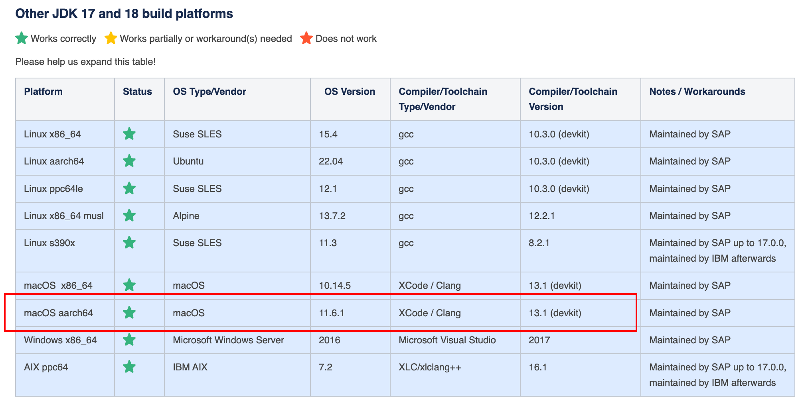
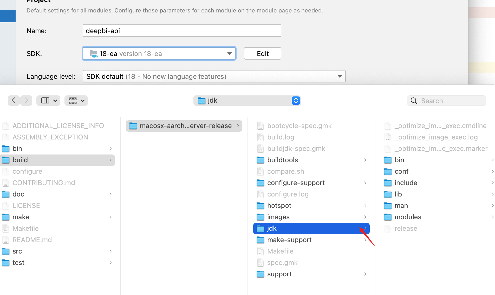

苹果系统M系列芯片编译JDK18

Macos Apple Silicon Build openJDK

## 为什么编译

之前听[blindpirate](https://github.com/blindpirate) 大佬说过, 为了解决某个fastjson的bug编译了一下jdk让其报出更详细的异常信息.

最近在读<深入理解java虚拟机(第三版 周志明)>, 第一章就是使用ubuntu 18 编译个openjdk12, 以供接下来学习使用. 想着不如就凑此机会用macos编译个jdk吧, 便开始了此次旅程. 

网络上没找到好的build openjdk的教程, 遂在此记录一下, 供朋友们少走弯路

我的电脑配置:

- 型号: 2020款 13寸 macbookPro M1
- OS: Macos 12.6.4

## 编译过程及使用

该[链接](https://gist.github.com/dgroomes/3af073b71c2c34581a155af9daa86564)提供了主要的实操思路,感谢前辈!

openJDK仓库中有一个相应版本的[build文档](https://github.com/openjdk/jdk/blob/jdk-17%2B2/doc/building.md)，介绍了build 的详细信息

最重要的是这篇[文档](https://wiki.openjdk.org/display/Build/Supported+Build+Platforms) 官方的build platforms wiki, 早看到他我能省一天的时间,也不至于走各种弯路. 进入链接后页面往下滑找到17&18部分, 可以获得的信息是官方使用系统版本是`11.6.1`, Xcode版本是`13.1`. 

> 官方文档的意义是:用指定的OS版本和Xcode版本一定可以成功
>
> 你可以继续翻看该页面, 可以发现是从jdk17才支持 apple sillicon 的
>
> 我就走了弯路, 用了非指定xcode, build了17以下的版本, 想看弯路的请直接看文章下半部分



### 环境准备

- OS: 与官方指定的最好,但现在还在用着11.X的系统的人不多了吧. 我的12.6.4编译成功啦,请放心使用. 
- Xcode: AppStore只能安装最新版本的, 就算下载到历史版本也只能让电脑存在一个Xcode且安装特别慢. 在此我推荐[Xcodes](https://www.xcodes.app/), 操作简单 安装快 可让同时存在多版本Xcode
- JDK17: 想编译X版本的jdk, 本地需要已安装X-1版本号的jdk. 我知道对某些朋友来说这不是常识,所以在此着重写出来

### 去Terminal中开始吧

```sh
# 下载jdk源码
git clone https://github.com/openjdk/jdk.git

cd jdk

# 切换到jdk18分支, 子版本可以认为是随便选的
git checkout jdk-18+32

# 从此分支上切出来一个新分支, 以备如果编译失败可以重来
git switch -c david-jdk-18

# 下方过程中会用到autoconf这个安装包, 提前安装
brew install autoconf

# 自动配置, 根据当前电脑生成相应的配置文件
bash configure

# (Optional) If you had previously cloned the code and executed a build you will want to first clean the project. Execute make clean.
# 如果需要的话, 请clean
[可选] make clean

# 开始编译! Wait for a long time
# 成功后当前文件夹下会生成的build文件夹, build/macos/images/jdk下,再往下就是jdk包那一大套东西啦
make images

# 验证是否成功, 就是调用一下java -version 命令
build/macosx-x86_64-server-release/images/jdk/bin/java -version
```

### 在idea中如何使用

指定项目的sdk为`build/macosx-x86_64-server-release/images/jdk`路径即可




## 如果不是指定环境会怎么样

没人教,没找到合适的教程, 就愣着头干, 装了弯路, 真羡慕看到此文章的你

遇到的错误很多,但当时只记录了几个, 希望能帮助到有其他需求的你

### 编译工具不用官方指定版本

我用Xcode14.0版本弄了一天，试了jdk-17分支、jdk-18别的分支，都报错啦

### 电脑上也有多个Xcode版本的话

解决方法:提供一个有效的 SDK 路径 

```shell
bash configure
# 报错信息如下, 这个错误提示是由于 configure 脚本无法找到 Xcode
 configure: error: No xcodebuild tool and no system framework headers found, use --with-sysroot or --with-sdk-name to provide a path to a valid SDK
 
 # --with-sysroot 参数接受一个Xcode的路径
 # 我系统中安装的是Xcode-14.0.1.app，也可能是别的版本13.1.0
bash configure --with-sysroot=/Applications/Xcode-14.0.1.app/Contents/Developer/Platforms/MacOSX.platform/Developer/SDKs/MacOSX.sdk
```


### 编译不支持的Apple sillicon的jdk版本

会编译失败,但请不要去解决, 因为解决完这一个还有后面一堆问题要解决,不要问我是怎么知道的

在此记录一个[pr](https://github.com/openjdk/jdk/pull/5180/files?diff=unified&w=0), 给jdk修bug,编译过程中的错误，其实就是加了个空格

> 
> 

## 去哪联系我

该文章我会发送到几个主流平台上, 反哺中文社区对我的帮助, 但不会查看/回复各平台的评论/私信, 因为我知道这种文章响应者寥寥.

如果想看文章的后续更新 or 查看我的更多文章, 请访问我的[博客](https://102418.xyz/)

如有讨论疑问请去[github repo](https://github.com/lijileiGood/lijileiGood.github.io) 提issue.


